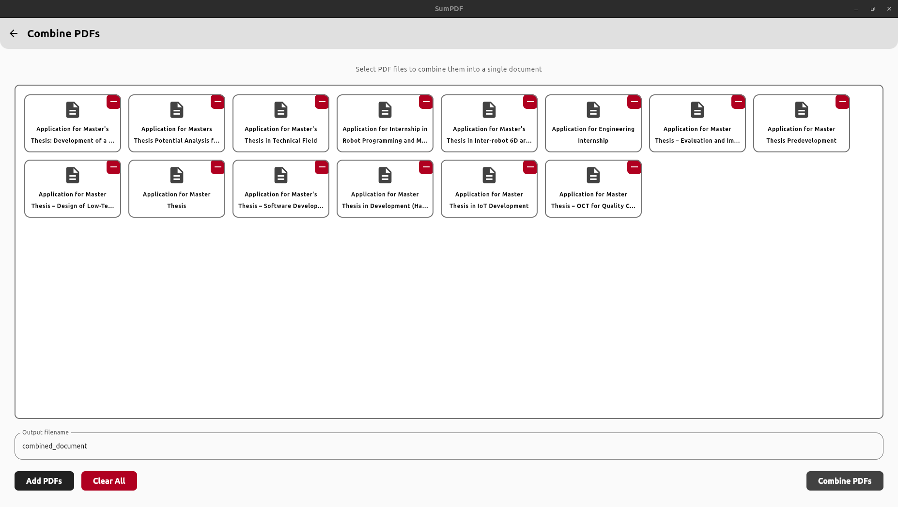

# SumPDF

**SumPDF** is a free and open-source desktop application built with [Compose for Desktop](https://github.com/JetBrains/compose-multiplatform?tab=readme-ov-file#desktop) that allows to effortlessly **combine** multiple PDF files and **convert** various files (like images or documents) to PDFs.

## Features

- **Combine PDFs**

  - Merge multiple PDF files into one.

- **Convert to PDF**
  - Convert `txt`, `odt`, `png`, `jpg`, `jpeg`, `svg` files into PDF documents.

## 🖥️ Screenshots

### Home Screen


### Combine PDFs



### Convert to PDF


## Build from source

Clone the repository:

```bash
git clone https://github.com/zahid4kh/sumpdf.git
cd sumpdf
```

- Run the app normally:

```bash
./gradlew :run
```

OR

- Run the app with hot-reload:

```kotlin
./gradlew :runHot --mainClass SumPDF --auto
```

## Contribution

Feel free to contribute!

## License

This project is licensed under the Apache 2.0 License. See [LICENSE](LICENSE) for more info.
